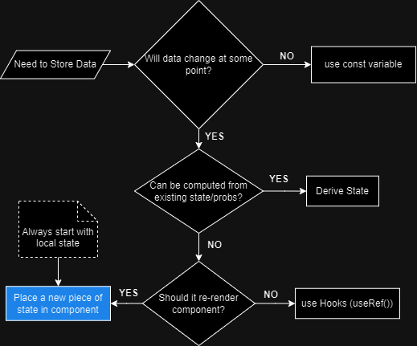
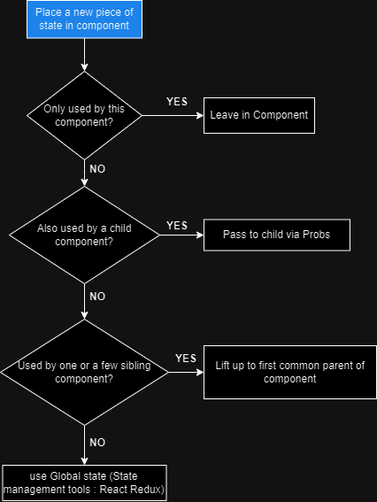

> THIS IS JUST REVIEW FOR ME FROM LEARN REACT.JS

> Challange 1 Code

```javascript
function App() {
  return (
    <>
      <div className="card">
        <Avatar />
        <div className="data">
          <Intro
            name="Fadhil"
            description="
my passion lies in software development, particularly web and mobile development. I'm self-taught and proficient in HTML, CSS, JavaScript, various frameworks, Java, and Kotlin."
          />
          <SkillList />
        </div>
      </div>
      <Footer />
    </>
  );
}

function Avatar() {
  return (
    
  );
}

function Intro({ name, description }) {
  return (
    <div>
      <h1>{name}</h1>
      <p>{description}</p>
    </div>
  );
}

function SkillList() {
  return (
    <div className="skill-list">
      {skillData.map((skill) => {
        return <Skill objectOf={skill} />;
      })}
    </div>
  );
}
function Skill({ objectOf }) {
  return (
    <>
      <div className="skill" style={{ backgroundColor: `${objectOf.color}` }}>
        <span>{objectOf.skills}</span>
        <span>
          {objectOf.level === "Beginner" && "🥲"}
          {objectOf.level === "Intermediate" && "☕"}
          {objectOf.level === "Advanced" && "🤖"}
        </span>
      </div>
    </>
  );
}

function Footer() {
  return (
    <div className="footer">
      <p>Made With react.JS</p>
    </div>
  );
}
```

> Challange 2 Code

```javascript
import { useState } from "react";

export default function App() {
  return (
    <div>
      <Counter />
    </div>
  );
}

function Counter() {
  const [count, setCount] = useState(0);
  const [step, setStep] = useState(1);

  function reset() {
    setCount(0);
    setStep(1);
  }

  const date = new Date();
  date.setDate(date.getDate() + count);

  return (
    <>
      <div>
        <input
          type="range"
          min="1"
          max="366"
          value={step}
          onChange={(e) => setStep(Number(e.target.value))}
        />
        <span>Step : {step}</span>
      </div>
      <div>
        <button onClick={() => setCount((e) => e - step)}> -</button>
        <input
          type="text"
          value={`${count} days`}
          onChange={() => setCount((e) => Number(e.target.value))}
        />
        <button onClick={() => setCount((e) => e + step)}>+</button>
      </div>
      <p>
        <span>
          {count === 0 && "Today date is "}
          {count > 0 && `${count} days from today is `}
          {count < 0 && `${Math.abs(count)} days ago was `}
        </span>
        <span>{date.toDateString()}</span>
      </p>
      <span>
        {count !== 0 || step !== 0 ? (
          <button onClick={reset}>Reset</button>
        ) : null}
      </span>
    </>
  );
}
```

> Challange 3 Code

```javascript
function App() {
  const [items, setItems] = useState([]);

  function handleDeleteItem(id) {
    setItems((remove) => remove.filter((item) => item.id !== id));
  }

  function handleComplete(id) {
    setItems((check) =>
      check.map((data) =>
        data.id === id ? { ...data, packed: !data.packed } : data
      )
    );
  }

  return (
    <div className="app">
      <Logo />
      <Form onAddItems={(em) => setItems((data) => [...data, em])} />
      <PackingList
        items={items}
        onDeleteItem={handleDeleteItem}
        onComplete={handleComplete}
      />
      <Stats />
    </div>
  );
}

function Logo() {
  return <h1>🌴Far Away👜</h1>;
}

function Form({ onAddItems }) {
  const [description, setDescription] = useState("");
  const [select, setSelect] = useState(1);

  function handleSubmit(e) {
    e.preventDefault();

    // IF DATA ITEM NOT INPUTED CAN'T SUBMIT
    if (!description) return;

    // ITEM DATA
    const newItem = {
      description,
      select,
      packed: false,
      id: Date.now(),
    };

    // ADD ITEM
    onAddItems(newItem);

    // RESET THE FORM AFTER SUBMIT
    setDescription("");
    setSelect(1);
  }

  return (
    <form className="add-form" onSubmit={handleSubmit}>
      <h3>What do you need for your trip?</h3>
      <select
        value={select}
        onChange={(e) => setSelect(Number(e.target.value))}
      >
        {Array.from({ length: 20 }, (_, index) => index + 1).map((num) => (
          <option value={num} key={num}>
            {num}
          </option>
        ))}
      </select>
      <input
        type="text"
        placeholder="Item..."
        value={description}
        onChange={(e) => setDescription(e.target.value)}
      />
      <button>Add</button>
    </form>
  );
}

function PackingList({ items, onDeleteItem, onComplete }) {
  return (
    <div className="list">
      <ul>
        {items.map((data) => (
          <Item
            dataList={data}
            onDeleteItem={onDeleteItem}
            onComplete={onComplete}
            key={data.id}
          />
        ))}
      </ul>
    </div>
  );
}

function Item({ dataList, onDeleteItem, onComplete }) {
  return (
    <li>
      <input
        type="checkbox"
        value={dataList.packed}
        onChange={() => onComplete(dataList.id)}
      />
      <span
        style={
          dataList.packed
            ? { textDecoration: "line-through" }
            : { textDecoration: "none" }
        }
      >
        {`${dataList.select} ${dataList.description}`}
      </span>
      <button onClick={() => onDeleteItem(dataList.id)}>❌</button>
    </li>
  );
}

function Stats() {
  return (
    <footer className="stats">
      <em>You have X items on your list, and you already packed X (X%)</em>
    </footer>
  );
}

export default App;
```

> When to use State in React?
<br>
<div style="text-align:center;">
  
</div>
<br><br>
> Where to use State in React?
<br>
<div style="text-align:center;">
  
</div>
