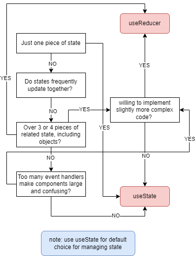

> THIS IS JUST REVIEW FOR ME FROM LEARN REACT.JS

> Challange 1 Code - REACT FUNDAMENTAL

Go to [Challange 1 Code](src/challange/challange1.jsx)

> Challange 2 Code - Events in REACT

Go to [Challange 2 Code](src/challange/challange2.jsx)

> Challange 3 Code - STATE Management (Derive state, lifting up state)

Go to [Challange 3 Code](src/challange/challange3.jsx)

> Challange 4 Code - Component Reusability and Component API

Go to [Challange 4 Code](src/challange/challange4.jsx)

> Challange 5 Code - UseEffect Hook

Go to [Challange 5 Code](src/challange/challange5.jsx)

> Challange 6 Code - Custom Hooks

Go to [Challange 6 Code](src/challange/challange6.jsx)

> Class based Component

Go to [Class based Component](src/class-based-comp/App.jsx)

> When to use State in React?

<br><br>

<p align="center">
  
</p>

<br><br>

> Where to use State in React?

<br><br>

<p align="center">
  
</p>

> Component vs Component Instance vs Element

**Component :**

- Description of a piece of UI
- A component is a function that returns react elements (element tree), usually written as JSX
- Component usually called as a "Blueprint" or a "Template" of UI

```javascript
// component
function App() {
  return (
    <ChildComponent state/props>
  )
}
```

The blueprint or template here will create one or more **Component instances.**

**Component Instances :**

- Component instance are created when use the components
- React internally calls the component as a "child"
- Component Instance are the actual "Physical manifestation of a component"
- Component instance has it owns state and probs
- Each component instance has a lifecycle (initialization, mounting, updating, unmounting )

```javascript
function App() {
  return (
    // Component instance
    <ChildComponent state/props>
    {/* javascript logic here.. */}
  )
}
```

Each of them will return one or more **React Elements.**

**React Elements :**

- JSX is converted to a function Calls

```javascript
React.createElement();
```

- A react elements is the result of these function calls
- A react elements basically contains all the information necessary to create DOM elements

```javascript
function ChildComponent() {
  return (
    <div className="content">
      <h4>The content here</h4>
    </div>
  );
}
```

All of that will be converted to :

```javascript
React.createElement(
  "div",
  {
    className: "content",
  },
  React.createElement("h4", null, "The content here")
);
```

This React Elements will eventually be converted to actual **DOM Elements (HTML)**

**DOM Elements (HTML) :**

- DOM elements are the actual **visual representation** of the component instance in the browser

```xml
<div className="content">
  <h4>The content here</h4>
</div>
```

---

**Thinking in React :**
Component Categories :

**_1. Stateless / presentational components_**

- No State
- Can receive probs and simply present received data or other content
- Usually small and reusable

**_2. Stateful components_**

- Have State
- Can still be reusable

**_3. Structural components_**

- "Pages", "Layout", or "screens" of the app
- Result of composition
- Can be huge and non-reusable (but don't have to reuse it)

**NOTE :**
It's not react elements that are rendered to the DOM. React elements just live inside the React App and have nothing to do with the DOM. They are simply converted to DOM elements when they are painted on the screen

> UseEffect Hook dependency Array

**When to use Dependency Array**

There are three types of dependency array

1. Without dependency Array

```javascript
useEffect(() => {
  console.log("Executed every render or after every render");
});
```

This will be executed every render or after the component render or re-renders

2. With Empty dependency Array

```javascript
useEffect(() => {
  console.log("Executed After Initial render");
}, []);
```

This will be executed when the component firstly renders or initial renders.

3. With dependency Array

```javascript
useEffect(() => {
  console.log("After triggered by state or variable");
}, [data]);
```

This will be executed when the state data or variable data has changed or has rendered

<br>

> useReducer Hooks

```javascript

const [state, dispatch] = useReducer(reducer, initialState, init?)
```

useReducer is one of the hooks provided by React. It's used to manage complex state in functional components. Similar to useState, but more suitable for complex state, especially if the state has complex logic as well. It takes a reducer function as the first argument and initial state as the second argument. The reducer function receives the previous state and an action,

**Usage**

```javascript
// this will be initial state
const initialState = {
  step: 1,
  count: 0,
};

// this will be reducer function

function reducer(state, action) {
  switch (action.type) {
    case "INCREMENT":
      return { ...state, count: state.count + state.step };
    case "DECREMENT":
      return { ...state, count: state.count - state.step };
    case "RESET":
      return initialState;
    default:
      throw new Error("Unknown Action");
  }
}

// usage on components

function Component() {
  const [state, dispatch] = useReducer(reducer, initialState);

  const handleReset = () => {
    // this will be back to initial State
    dispatch({ type: "RESET" });
  };

  const handleDecrement = () => {
    dispatch({ type: "DECREMENT", value: -1 });
  };

  const handleIncrement = () => {
    dispatch({ type: "INCREMENT", value: 1 });
  };
}
```

> useState vs useReducer

**useStae**

- Ideal for single, independent pieces of state
- Logic to update state is placed directly in event handlers or effects, spread all over one or multiple components
- State is updated by calling setState (setter returned from useState)
- Imperative state updates
- Easy to understand and to use

**useReducer**

- Ideal for multiple pieces of state and complex state
- Logic to update state lives in one central place, decoupled from components : **The Reducer**
- State is updated by dispatching an action to a reducer
- Declarative state updates : complex state transitions are mapped to actions
- More difficult to understand and implement

> When to use useReducer

<p align="center">
  
</p>
